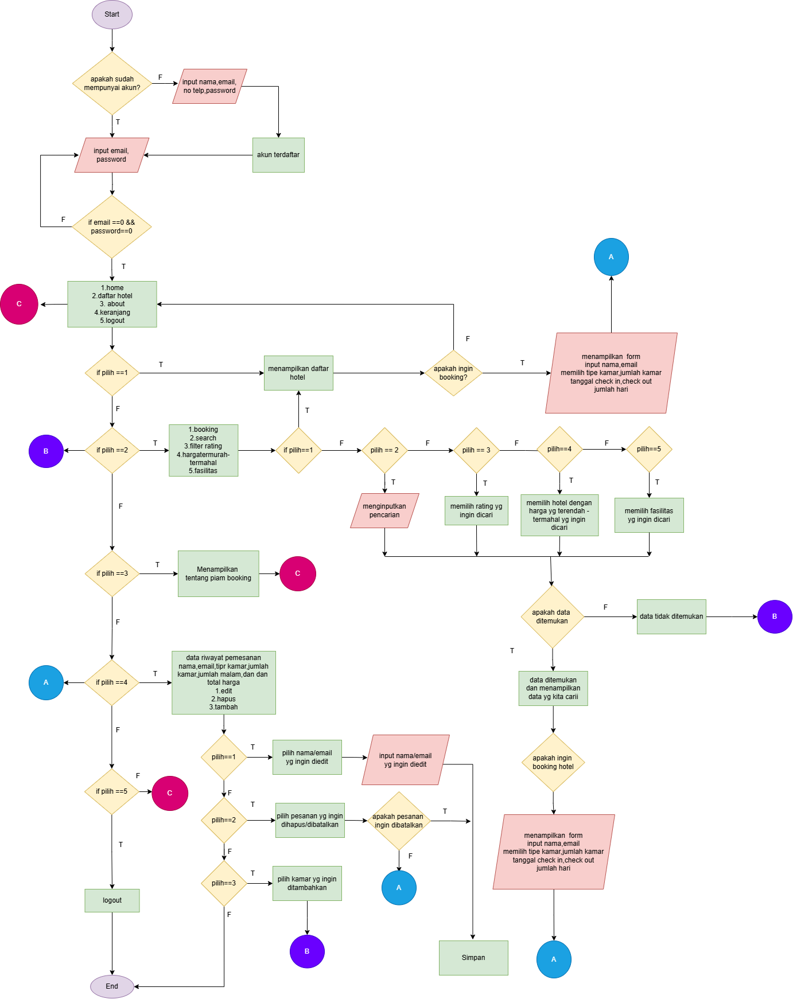

# PIAM BOOKING - Sistem Pemesanan Hotel (Pembayaran di Hotel)

Sistem Pemesanan Hotel ini memungkinkan pengguna untuk memesan kamar hotel secara online, dengan pembayaran dilakukan langsung di hotel saat check-in. Pengguna dapat memilih hotel, menentukan tanggal check-in dan check-out, dan memesan kamar sesuai preferensi mereka.

## Fitur Utama

- **Login & Registrasi**: Pengguna dapat mendaftar dan masuk untuk ke halaman home untuk membooking hotel.
- **Halaman Utama (Home)**: Daftar hotel yang tersedia untuk dipesan dan daftar hotel popular.
- **Detail Hotel**: Menampilkan informasi lengkap tentang hotel, fasilitas, dan kamar yang tersedia.
- **Pencarian Hotel**: Fitur pencarian hotel berdasarkan nama, lokasi, rating, dan bisa memfilter fasilitas, serta harga terendah-terbesar.
- **Pemesanan Kamar**: Pengguna dapat memilih kamar, menetapkan tanggal check-in dan check-out, serta melakukan pemesanan tanpa perlu membayar di muka.
- **Pembayaran di Hotel**: Pembayaran dilakukan langsung di hotel saat check-in, dengan pilihan berbagai metode pembayaran.
- **My Orders**: Pengguna dapat melihat status pemesanan mereka, termasuk detail pemesanan dan bisa juga mengedit data, membatalkan pesanan, dan menambah pesanan.

## Flow Chart

